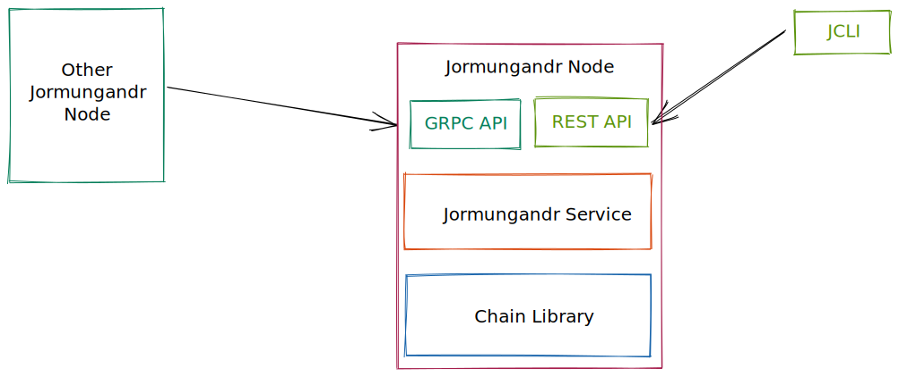

# jormungandr-integration-tests

Integration test is a container project for all jormungandr & jcli tests. Tests are validating node correctness, stability and interaction with database/rest api. Also there are non-functional tests which verify node durability and reliability

## Architecture of tests

Jormungandr tests architecture relies on test pyramid approach, where most of the effort is put into until and api level and small amount of tests on E2E. Thanks to that we can create fast and reliable tests.


Before approaching Jormungandr testing we need to first remind ourselves a simplified architecture diagram for jcli & jormungandr.



## Quick start

### Prerequisites

In order to run test jormungandr & jcli need to be installed or prebuild.

### Start tests

In order to build jormungandr-automation in main project folder run:
```
cd testing
cargo test
```

## Tests categories

Test are categories based on application/layer and property under test (functional or non-functional: load, perf etc.)
Below diagram is a good overview:


### How to run all functional tests

```
cd testing/jormungandr-integration-tests
cargo test jormungandr --features network
```

### How to run jcli only functional tests

```
cd testing/jormungandr-integration-tests
cargo test jcli
```

### How to run single node functional tests
```
cd testing/jormungandr-integration-tests
cargo test jormungandr
```

### How to run single node performance tests
```
cd testing/jormungandr-integration-tests
cargo test jormungandr::non_functional --features sanity,non-functional
```

### How to run single node endurance tests
```
cd testing/jormungandr-integration-tests
cargo test jormungandr::non_functional --features soak,non-functional
```


### How to run network functional tests
```
cd testing/jormungandr-integration-tests
cargo test jormungandr::network --features network
```

### How to run network performance tests
```
cd testing/jormungandr-integration-tests
cargo test jormungandr::non_functional::network --features sanity,non-functional
```

### How to run network endurance tests
```
cd testing/jormungandr-integration-tests
cargo test jormungandr::non_functional::network --features soak,non-functional
```

### Frequency
Functional tests are run on each PR. Performance and testnet integration tests are run nightly
