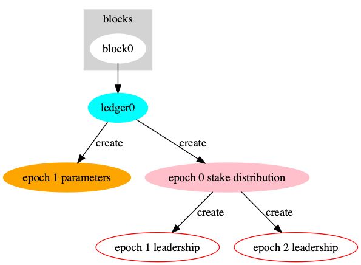

# Internal Design

Glossary:

* **blockchains**: the current blockchain and possibly different known forks.
* **clock**: general time tracking to know the time in blockchain unit (epoch/slot)
* **tip**: the current fork that is considered the correct one, related to consensus algorithm.

## Tasks.

Each node runs several tasks. Task is a process with a clearly defined interface
that abstracts a particular task.

General tasks:

* **Network task**: handle new connections, and perform lowlevel queries.
  It does queries parsing and routing them to the other tasks: block,
  client or transaction tasks.

* **Block task**: handles blocks reception from other nodes and the leadership
  thread. The blocks can be external and internal. External block (...), and
  internal block (...).
  When the task receives an external block it validates the block. If validation
  succeeds then the task appends blocks to the blockchain and checks if the tip
  needs any changes.
  When the task receives an internal block it does the same actions except for
  block validation. And then broadcasts the change of the tip to the network
  thread.

* **Leadership task**: waits for each new slot, evaluates if this node is
  a slot leader. In case if it is, the task creates a new block
  (with a set of known transactions) referencing the latest known
  and agreed block in the blockchain. Then the task sends it to the block
  thread for processing.

* **Client task**: receives block header/body queries. This task is in charge
  of in accord [!!!] with the blockchains, reply to the client.

* **Transaction task**: receives new transactions from the network,
  validates transaction and handle duplicates.
  Also the broadcast to other nodes new (valid) transaction received.

## Maintaining the blockchain's state

The `blockchain` module is responsible to maintaining the blockchain (i.e.) the blocks,
the current working branches (we will come back to it in a bit), the different states
associated to every blocks, the epoch's data (the parameters, the stake active distribution
and the leadership schedule).

It is fairly easy to maintain the blocks of a blockchain. They all have the identifier of
the parent block. Storing them is another story though and is not covered here.

* `block0` or `blockx.y` are blocks of the blockchain. They `link` to the parent block except for the
  `block0` which may not have parents here (there is a special case where we could set a parent pointing
  to the block of a previously known state of the blockchain);
* `legder0` or `ledgerx.y` are states of the blockchain at a given `block`;
* `epoch x parameters` are the blockchain parameters that are valid for all the epoch `x`;
* `epoch N stake distribution` are the stake distribution as extracted from epoch `N`;
* `epoch x leadership` is the leadership schedule for the epoch `x`.

This may seem a bit overwhelming. Let's follow the flow of block creations and validation
on this blockchain:

### From the block 0

Let's start with first initializing the blockchain from the `block0`.

The **first block**, the `block0`, is the block that contains the initial data of the blockchain.
From the block0 we can construct the **first ledger**: the `ledger0`.

From the ledger0 we can extract two objects:

* `epoch 1 parameters` which will contains the fee setting to apply during the epoch 1;
* `epoch 0 stake distribution`. This is the stake distribution at the end of the epoch 0 (and
  before the following epoch starts);

And now from the `epoch 0 stake distribution` we can determine the leadership schedules for the
epoch 1 and the epoch 2.

### for a block

The view from the point of view of a block `k` at an epoch `N` (`block N.k`) looks like the following:

It links to the parent block: `block N.(k - 1)`. This is important because it allows us to retrieve the
ledger state at the block `N.(k - 1)`. In order to accept the block `N.k` in the blockchain we need to
validate a couple of things:

1. the block N.k is correctly referring to the block N.(k - 1):
    * the block date is increasing;
    * the block number is strictly monotonically increasing;
2. the schedule is correct: the block has been created by the right stake pool at the right time;
3. the `block N.k` is updating the parent's ledger state (`ledger N.(k - 1)`) and is producing a
   valid new ledger: `ledger N.k`

### epoch transition

Epoch transition happen when we switch to an epoch to the following one.

