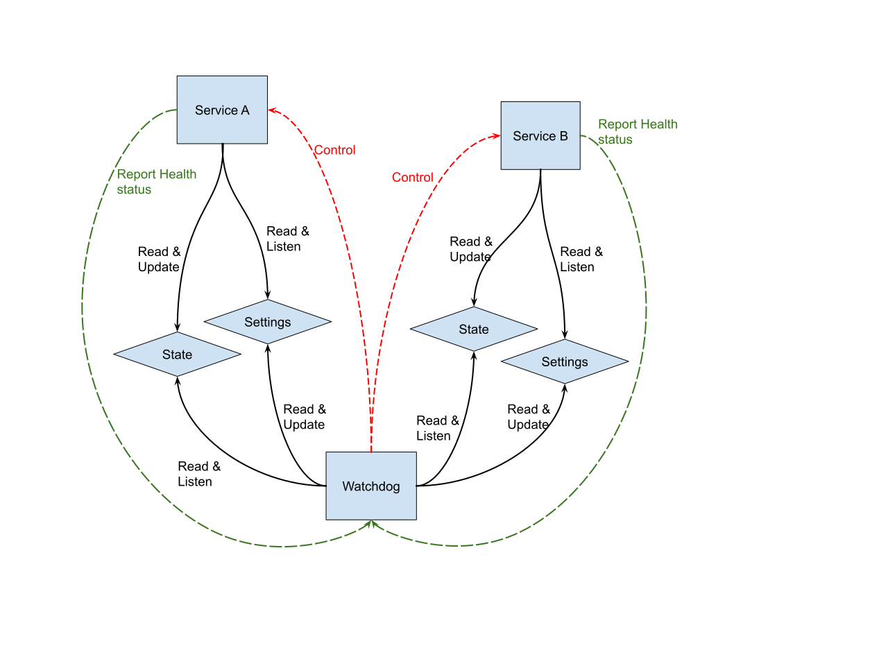

# High level overview

Firstly, let's define the different features we are looking for. The 5
different areas of features will be the drive for this document and the
associated implementation.

1. **Service Setting**: A service must provide a set of settings and parameters
   it needs to have access to in order to operate. The service needs to have a
   read-only access and be notified of any modification performed.
2. **Service State**: A service needs to be able to manage a state. An object
   that conserves on going information necessary to the execution. The state
   can be read by the watchdog in order to create snapshot for fast recovery or
   for bug reports.
3. **Intercommunication**: Services may need to communicate between each other.
   In the case of Jörmungandr, the network service forward new block contents
   (transactions) to the mempool service. A service should be able to ask the
   manager for a communication channel to another service.
4. **Service Health check**: The watchdog must be able to query a service's
   health. In order to do this a service will need to report different levels
   of errors, yet to be defined.
5. **Service Control**. The watchdog must be able to restart a service as
  necessary. Either because a service has entered an invalid state and can be
  restarted or because it is required for any other reasons.

## Service Setting

Services might require some settings from the system operator. For example, for
Jörmungandr Node: the network service requires knowing which socket (address
and port number) to listen, the logging service needs to know the debug level
filter.

Often we have felt the need for some settings to be updated while the node was
still running. It can be to change the log filter or update some network
parameters.

| | |
|:--:|:--|
| HLR-CFG-1 | A service can define some settings for the watchdog to manage |
| HLR-CFG-2 | If the watchdog is notified of a setting change it will notify the service of the change |
| HLR-CFG-3 | A service may have no settings |

## Service State

Services can have a state they manage and update for the good execution of the
service. The High Level Requirements (HLR) need to describe the actions
necessary for operating the state handling for the watchdog and how the
services may use the state object.

| | |
|:--:|:--|
| HLR-SS-1 | A service can define a state for the watchdog to monitor |
| HLR-SS-2 |If the state is modified the watchdog is notified |
| HLR-SS-3 | A service may have no state |

## Intercommunication

Services may need to communicate with (query from) each other. One of the
methods to do so is to have a communication channel ready when starting the
services. However as the number of services grows it brings other kinds of
issues. The watchdog instead will allow service discoverability. A service
may ask the watchdog to have a communication line to another service.

| | |
|:--:|:--|
| HLR-IC-1 | A service may registers to the watchdog a unique identifier (Service IDentifier: SID) |
| HLR-IC-2 | A service can require a communication line with another service to the watchdog via the SID |
| HLR-IC-3 | If no communication line was registered, the watchdog will say so to the requesting service. |

## Service Health Check

The health check is a mandatory feature for any registered service. Any running 
services must implement a health check handler. It allows the watchdog to query 
at any given time the service for its good operation capabilities.

| | |
|:--:|:--|
| HLR-HC-1 |A service's health check can be used by the watchdog to evaluate the status of the service |
| HLR-HC-2 | The health check status is updated by the running service on appropriate detected errors |

## Service Control

The Watchdog needs to be able to start, shutdown or power off any services as 
required. May it be automatically required by the watchdog (depending on the 
service's health check status or operational needs) or by an operator request.

| | |
|:--:|:--|
| HLR-CTRL-1 | The watchdog can start a service |
| HLR-CTRL-2 | The watchdog can send a shutdown request to a service |
| HLR-CTRL-3 | The watchdog can power off a service (forcing the service shutdown, not allowing time for the service to save state or properly clean resources) |
| HLR-CTRL-4 | The service updates its control status so the watchdog can monitor startup or shutdown progress |

