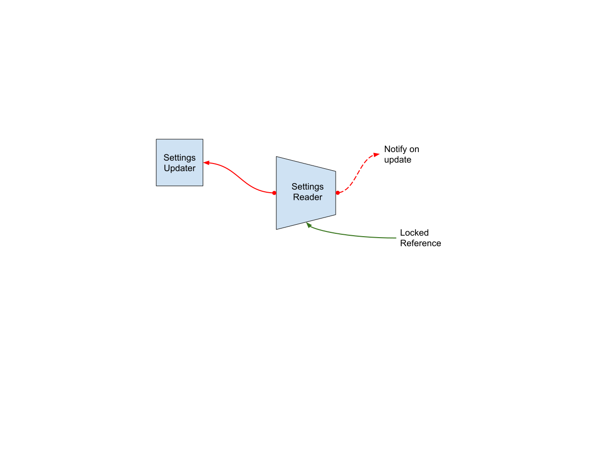
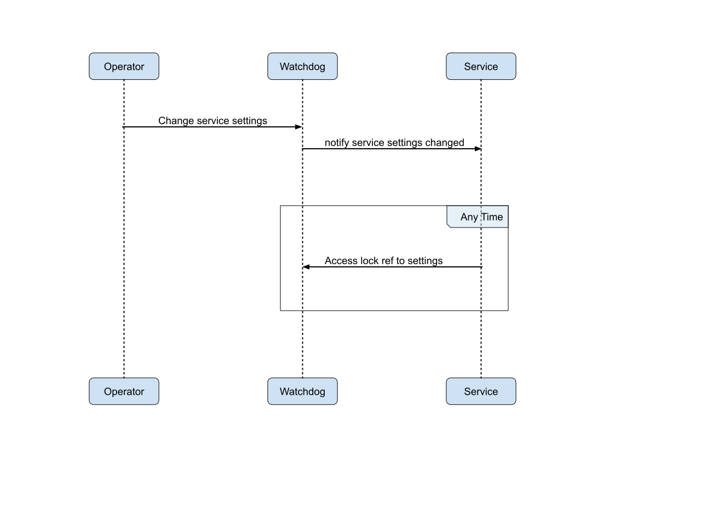
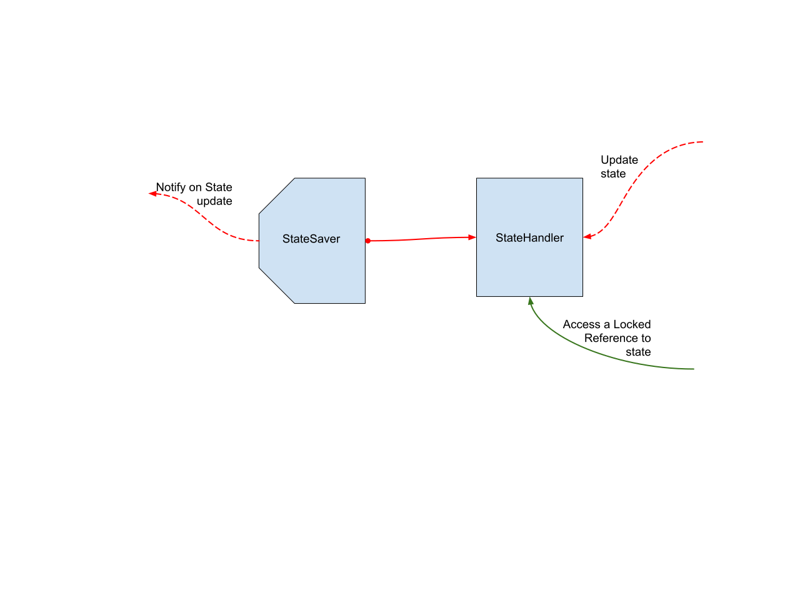
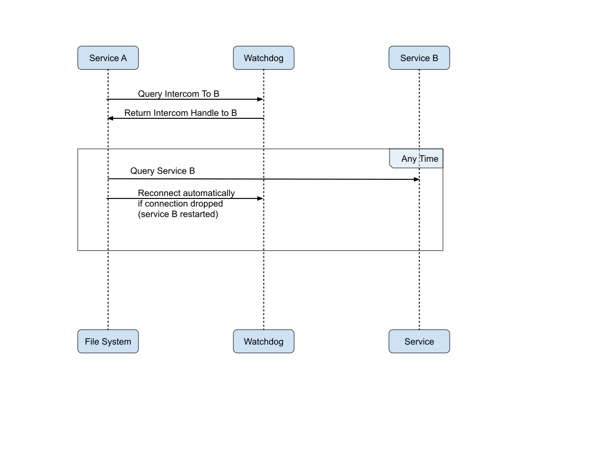

# Low level overview

Even before these requirements were written down, this was already the aim of 
the Jörmungandr code base to be close to this kind of approach. However the 
monolithic application approach started to show signs of fatigue and the code 
became more and more difficult to maintain or update.

Based on the requirements we are going to work on a microkernel-based-like 
application. The idea is to write the core component that we are going to call 
the watchdog for simplicity. This core component will be responsible for 
maintaining the services running, monitoring their activities, settings and 
execution state as well as allowing any services to request connecting to any 
other service intercommunication handle (see below).
Service Toolkit
First thing will be to design and implement a set of tools to use as standard 
approach to handling some features of a service: configuration, state 
management, intercom and status.

## Service's settings

As defined in HLR-CFG-1 and HLR-CFG-2 a service may define a set of parameters 
that can be updated live by the application operator. Thankfully there is 
already something we can use from the tokio crate: tokio::sync::watch::*.

> Display how the settings handlers will work, how they are linked
to each others and the kind of operations available

Upon registration of a new Service, the watchdog will create a new 
SettingsUpdater with the initial value. It can be the default value or the 
value read from the current global configuration (HLR-CFG-1). When the Service 
starts, a SettingsReader is created from the SettingsUpdater and is passed to 
the Service. If the service's settings are modified, the SettingsReader will 
yield an event (HLR-CFG-2). But also at any given time the Service can require 
the SettingsReader to access the current settings.

> Example of normal operation flow of the service settings

| | |
|:--:|:--|
| LLR-CFG-1 | On registration of a service, the watchdog creates a SettingsUpdater object with the associated initial settings. |
| LLR-CFG-2 | A SettingsReader object can be created from the SettingsUpdater, linking both objects together. |
| LLR-CFG-3 | The SettingsUpdater allows setting a new settings for the service |
| LLR-CFG-4 | The SettingsReader has an updated async function that will return every time the SettingsUpdater has received a new value. |
| LLR-CFG-5 | The SettingsReader's updated async function does not yield on the initial settings. |

## Service's State

While operating, a service may keep some internal states. This can be recording 
blockchain's data, different branches (forks) or the p2p's current topology. 
This state may be updated and sometimes it is even more beneficial to be able 
to reload from a previously known state. The idea here is to provide a state 
management, similar to the Service's Settings but this time, it is not the 
watchdog who controls the update side of thing: it is the service to update the 
state.

> Show the different objects and operations of the state management tool

The StateHandle is an object that is kept by the service during its execution 
and it will be used to either access the current State or to update the State. 
The StateSaver is held by the watchdog. On update of the State, the saver will 
be notified and the watchdog will then be able to make a persistent copy of the 
state. This allows that, on restart of the service, the service can restart 
with the previously known state. Saving non necessary operations and recovering 
faster from errors.

> Example of how the state flow will work under normal operations

| | |
|:--:|:--|
| LLR-SS-1 | On registration of a service, the watchdog creates a StateSaver object with the associated initial state value. |
| LLR-SS-2 | A StateHandler object can be created from the StateSaver, linking both objects together. |
| LLR-SS-3 | The StateHandlers allows accessing the current state of the service |
| LLR-SS-4 | The StateHandlers allows updating the state of the service, notifying the StateSaver of the updated value. |
| LLR-SS-5 | On initial construction of the State, the state does not yield the initial value |

## Intercommunication

The intercommunication between the services is established at runtime, upon 
query from a service to have access to another service. For example, in the 
schema below Service A will request an Intercom handle to Service B. This 
intercom will be used to send queries to the Service B. This handle is 
responsible for re-establishing the connection to Service B if the Service B 
has been restarted. These connections are not bidirectional. The messages 
needs to handle the possible reply or Service B needs to establish an Intercom 
handle to Service A.

Another interesting point from using these Intercom handles is that it is 
possible to monitor the communication and the healthiness of a service. For 
example it is possible to monitor the propagation pace of an intercom message, 
the number of intercom opened to a service…

| | |
|:--:|:--|
| LLR-IC-1 | On registration of a service, the watchdog creates an intercom handle and receiver. |
| LLR-IC-2 | The intercom handle can be queried to the watchdog by any service to connect to any service. |
| LLR-IC-3 | The intercom handle is responsible to keep the connection to the service up. |
| LLR-IC-4 | Some stats are gathered regarding the intercom message propagation (speed mean, variance and standard distribution) |

## Status Health Check

The status health check can be monitored by 2 means: the service manager stores 
the different interactions with the service, such as the uptime, the status 
(shutdown, shutting down, starting, started...) and also some intercoms 
statistics.

## Service Control

The WatchdogQuery has a unique set of commands that can be sent to the watchdog 
in order to control the watchdog. I.e. to register new services, start or 
update a setting. This is a privilege control channel to the watchdog and it is 
important the services are careful with not calling some controls without 
understanding the consequences (i.e. shutting down a service or the whole 
application).

# Readily available services

Provide readily available services.

## Logging

The watchdog and services are already ready to log events and spans. However by 
default there is no subscriber to catch these logs. The idea is to provide a 
service to handle the configuration (and dynamic changes of the configuration) 
of the logging output management.

Also, it is possible to register some telemetries that could be useful for 
debug and performance analysis of some of the operations in the nodes. It is 
possible to use https://crates.io/crates/tracing-opentelemetry to collect 
telemetry details and propagate them in an enjoyable format.

## Resource Manager

This would be useful to have but a bit more complex. The idea is to provide a 
way to control the resources and prevent one service vampirising all other 
services. Having a resource manager would allow a dev to have a common place to 
monitor and control the different resources in use and also to prioritise some 
services. For example one could write such a service to allow automatically 
stealing a resource from one service to distribute to another service who has 
higher priority needs.